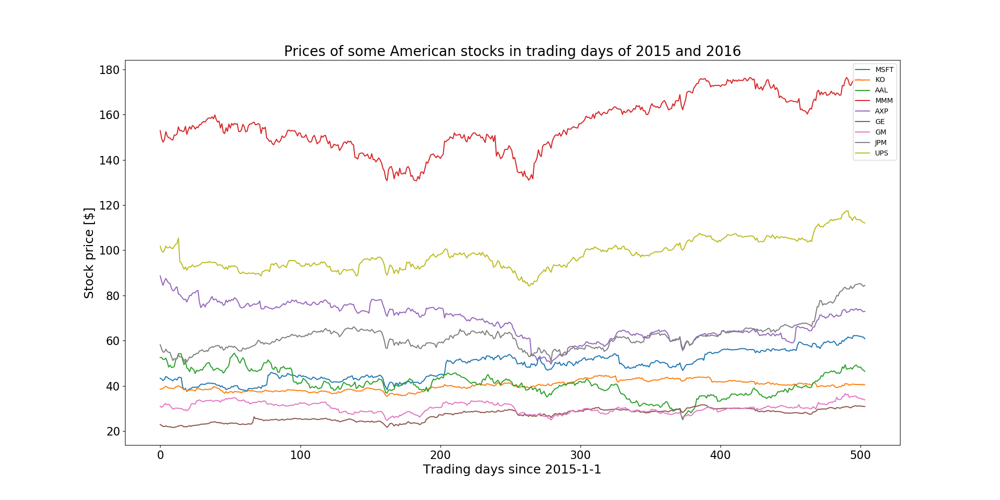
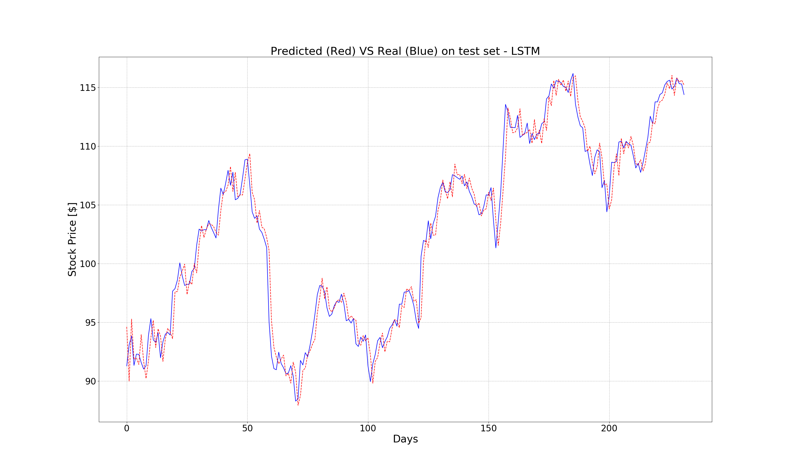
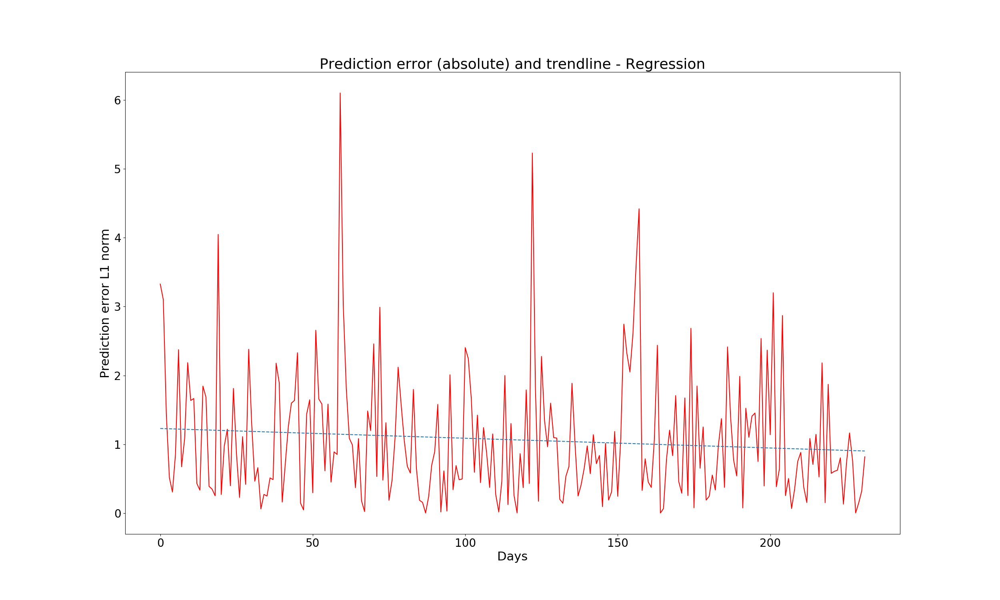
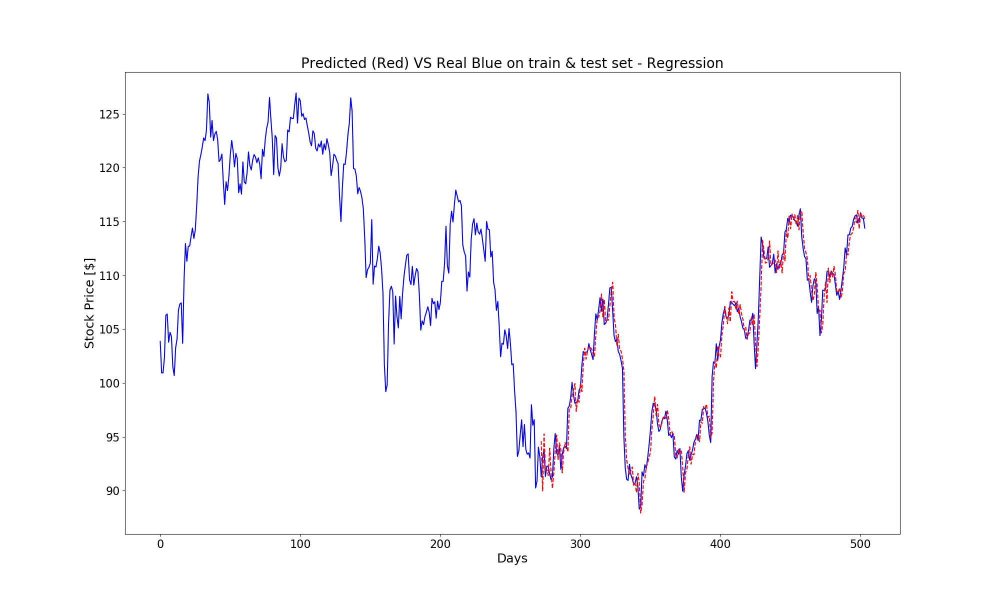
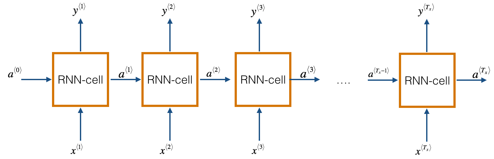
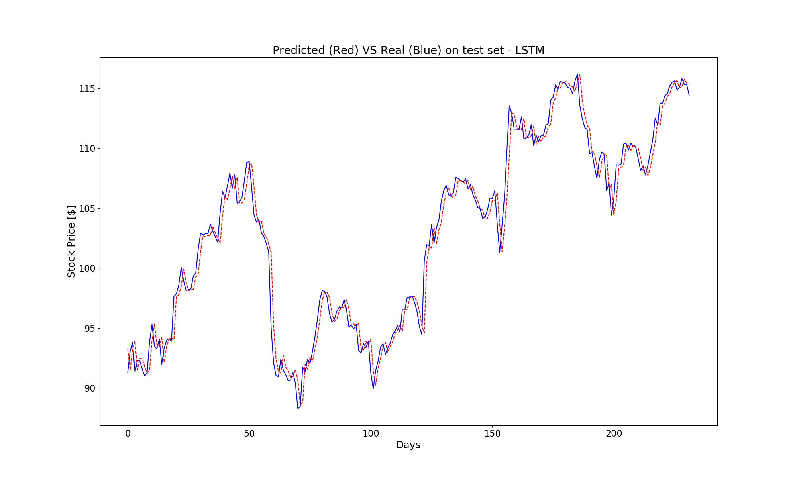
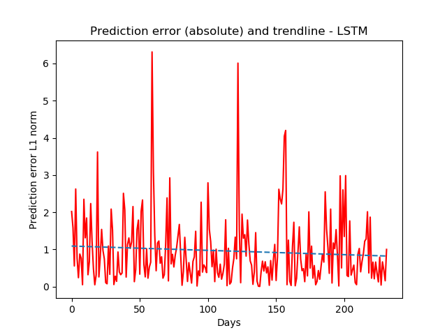
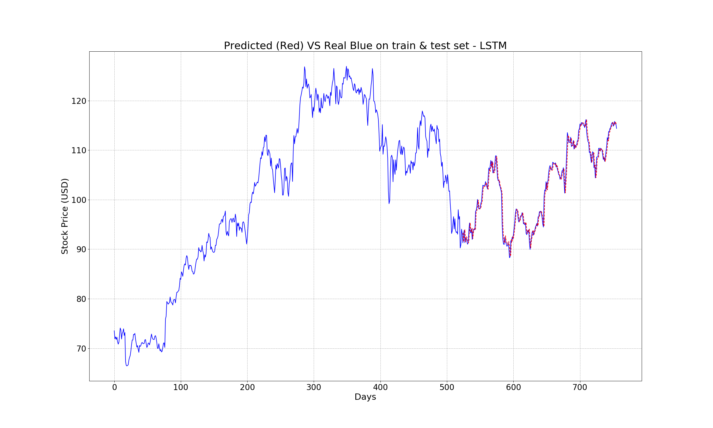
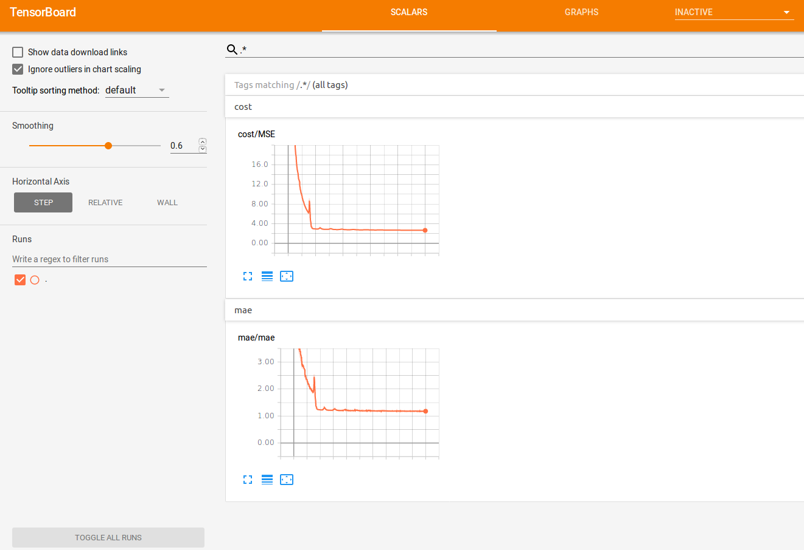
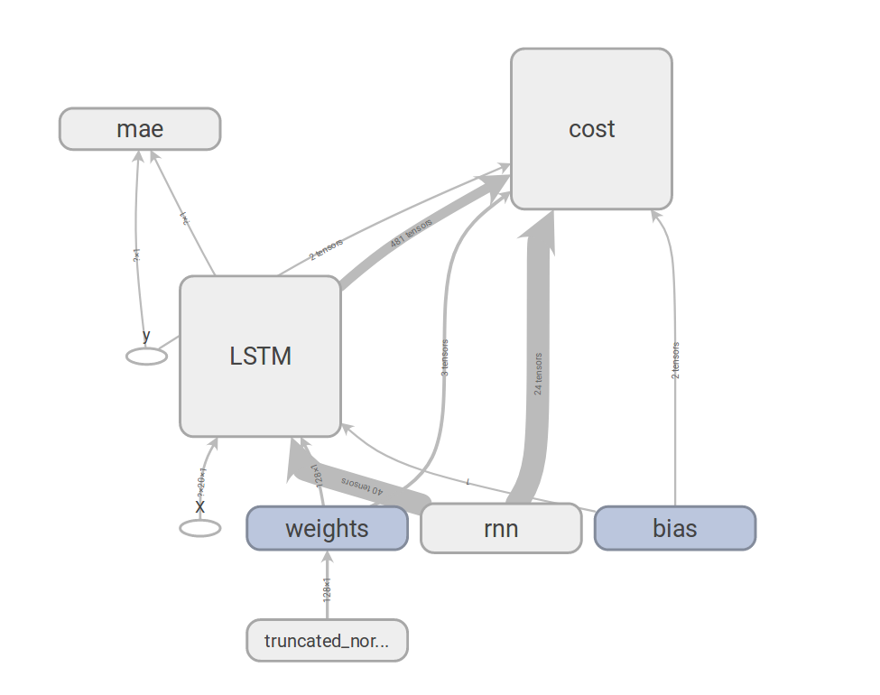

# Overview
This project presents two methods of how to predict a timeseries composed of real values. Specifically, we will predict the stock price of a large company listed on the NYSE stock exchange given its historical performance by using two type of models: regression and LSTM (long short-term memory).

# Table of contents

I. [**Prepare the input dataset**](#prepare_input)
 1. [Download the dataset](#download_dataset)
 2. [Format the dataset](#format_dataset)
 3. [Visualize the dataset](#visualize_dataset)
 
II. [**Stock Price Prediction**](#stock_price_prediction)
 1. [Functions to evaluate model](#functions_evaluate_model)
 2. [Linear Regression Model](#linear_regression)
 3. [Long Short-Term Memory Model](#lstm) <br />
    3.1. [Introduction of LSTM](#introduction_lstm)<br />
     3.2. [Stock Price Prediction using LSTM](#stock_price_prediction_lstm)


<div style="text-align: justify" markdown="1">
# I. Prepare the input dataset <a name="prepare_input"></a>
## 1. Download the dataset <a name="download_dataset"></a>
The first step of this  project is to obtain the historical data of stock price. Financial data can be expensive and hard to extract, that's why in this experiment we use the Python library `quandl` to obtain such information. This library has been chosen since it is easy to use and it provides a limited number of free queries per day. Quandl is an API,and the Python library is a wrapper over the APIs. To see a sample data returned by this API, run the folowing command in your prompt:

```JSON
curl "https://www.quandl.com/api/v3/datasets/WIKI/FB/data.csv"
Date,Open,High,Low,Close,Volume,Ex-Dividend,Split Ratio,Adj. Open,Adj. High,Adj. Low,Adj. Close,Adj. Volume
2018-03-27,156.31,162.85,150.75,152.19,76787884.0,0.0,1.0,156.31,162.85,150.75,152.19,76787884.0
2018-03-26,160.82,161.1,149.02,160.06,125438294.0,0.0,1.0,160.82,161.1,149.02,160.06,125438294.0
2018-03-23,165.44,167.1,159.02,159.39,52306891.0,0.0,1.0,165.44,167.1,159.02,159.39,52306891.0
2018-03-22,166.13,170.27,163.72,164.89,73389988.0,0.0,1.0,166.13,170.27,163.72,164.89,73389988.0
2018-03-21,164.8,173.4,163.3,169.39,105350867.0,0.0,1.0,164.8,173.4,163.3,169.39,105350867.0
2018-03-20,167.47,170.2,161.95,168.15,128925534.0,0.0,1.0,167.47,170.2,161.95,168.15,128925534.0
2018-03-19,177.01,177.17,170.06,172.56,86897749.0,0.0,1.0,177.01,177.17,170.06,172.56,86897749.0
2018-03-16,184.49,185.33,183.41,185.09,23090480.0,0.0,1.0,184.49,185.33,183.41,185.09,23090480.0
```

The format is a CSV, and each line contains the date, the opening price, the highest and the lowest of the day, the closing , the adusted, and some volumes. The lines are sorted from the most recent to the least. The columns we are intested in is the **Adj. Close**, which is the closing price after adjustment. 

Let's build a Python function to extract the adjusted price using the Quandl APIs. The function we are looking for should be able to cache calls and specify an initial and final timestamp to get the historical data beyond the symbol. Here's the code to do so, which is put in the `tools.py` script:

```python
import os
import pickle
import quandl
import numpy as np
import datetime

##################################
# DOWNLOAD DATASETS
##################################

def date_obj_to_str(date_obj):
    return date_obj.strftime('%Y-%m-%d')


def save_pickle(something, path):
    if not os.path.exists(os.path.dirname(path)):
        os.makedirs(os.path.dirname(path))
    with open(path, 'wb') as fh:
        pickle.dump(something, fh, pickle.DEFAULT_PROTOCOL)
        

def load_pickle(path):
    with open(path, 'rb') as fh:
        pkl = pickle.load(fh)
    return pkl
   
    
def fetch_stock_price(symbol, from_date, to_date, che_path="./tmp/prices/"):
    assert(from_date <= to_date)
    
    filename = "{}_{}_{}.pk".format(symbol, str(from_date), str(to_date))
    price_filepath = os.path.join(cache_path, filename)

    try: 
        prices = load_pickle(price_filepath)
        print("loaded from", price_filepath)

    except IOError:
        historic = quandl.get("WIKI/" + symbol,
                                         start_date=date_obj_to_str(from_date),
                                         end_date=date_obj_to_str(to_date))

        prices = historic["Adj. Close"].tolist()
        save_pickle(prices, price_filepath)
        print("saved into", price_filepath)

    return prices
```
The returned object of the function `fetch_stock_price` is a mono-dimensional array, containing the stock price for the requested symbol, ordered from the *from_date* to the *to_date*. Caching is done within the funciton, which means if a cache is missed, then the *quandl* API is called. The `date_obj_to_str` function is just a helper function, to convert *datetime.date* to the correct string format needed for the API.

To validate the `fetch_stock_price` function, let's print the adjusted price of the Google stock price (whose symbol is GOOG) for January 2018:

```python
print(fetch_stock_price("GOOG", datetime.date(2018,1,1), datetime.date(2018,1,31)))
```

The output, which is the stock price of Google in January 2018, is shown below:

```JSON
[786.14, 786.9, 794.02, 806.15, 806.65, 804.79, 807.91, 806.36, 807.88, 804.61, 806.07, 802.175, 805.02, 819.31,823.87, 835.67, 832.15, 823.31, 802.32, 796.79]
```

## 2. Format the dataset <a name="format_dataset"></a>

In order to feed in the machine-learning models, the input data needs to be in the form of multiple observations with a number of feature size. Since timeseries data is mono-dimensional array, we don't have a such pre-defined length. Therefore, instead of varying the number of features, we will change the number of observations, maintaining a constant feature size. Each observation represents a temporal window of the timeseries, and by sliding the window of one position on the right, we create another observation. Here is the code to do so (still in `tools.py` script):


```python
###########################################
# FORMAT THE DATASETS
##########################################

def format_dataset(values, temporal_features):
    feat_splits = [values[i: i+temporal_features] for i in range(len(values) - temporal_features)]
    feats = np.vstack(feat_splits)
    labels = np.array(values[temporal_features:])
    return feats, labels


# Function to reshape matrices to mono-dimensional (1D) array
def matrix_to_array(m):
    return np.asarray(m).reshape(-1)
```

Given the timeseries, and the feature size, the function creates a sliding window which sweeps the timeseries, producing features and labels (that is, the value following the end of sliding window, at each iteration). Finally, all the observations are piled up vertically, as well as the labels. The outcome is an observation with a defined number of columns, and a label vector.

## 3. Visualize the dataset <a name="visualize_dataset"></a>

Lets' visualize the stock prices of some most popular companies in the United States in two years: 2015 and 2016. Feel free to change the **symbols** and **date** to visualize your favorite company'stocks in different time period.


```python

symbols = ["MSFT", "KO", "AAL", "MMM", "AXP", "GE", "GM", "JPM", "UPS"] # companies's code
ax = plt.subplot(1,1,1)
for sym in symbols:
    prices = fetch_stock_price(sym, datetime.date(2015, 1,1), datetime.date(2016, 12,31))
    ax.plot(range(len(prices)), prices, label=sym)
handles, labels = ax.get_legend_handles_labels()
ax.legend(handles, labels)
plt.xlabel("Trading days since 2015-1-1")
plt.ylabel("Stock price [$]")
plt.title("Prices of some American stocks in trading days of 2015 and 2016")
plt.savefig("./graph/stock_prices_2015_2016.png")
plt.show()
```

The plot is shown below:



# II. Stock Prices Prediction <a name="stock_price_prediction"></a>
Given the observation matrix and a real value label, we first approach the problem as a regression problem. However, this approach is not ideal in the case of timeseries data. Treating the problem as a regression problem, we force the algorithm to think that they each feature is independent, while instead, they are correlated, since they are the window of the same timeseries. Anyway, let's start with this simple assumption (each feature is independent),and see later how it can be improved by exploiting the temporal correlation.

## 1. Functions to evaluate model <a name="function_evaluate_model"></a>
In order to evaluate the model, we first create a function that, given the observation matrix, the true labels, and the predicted ones, will output the metrics in term of **mean_square_error (MSE)** and **mean absolute error (MAE)** of the prediction. It will also plot the training, testing, and predicted timeseries one onto another, to visually check the performance. The function is put into the `evaluate_ts.py` file, so other scripts can access it:


```python
import numpy as np
from matplotlib import pylab as plt
from tools import matrix_to_array

def evaluate_ts(features, y_true, y_pred):
    print("Evaluation of the predictions:")
    print("MSE: ", np.mean(np.square(y_true - y_pred)))
    print("mae: ", np.mean(np.abs(y_true - y_pred)))

    print("Benchmark: if prediction == last feature (prediction without any model)")
    print("MSE: ", np.mean(np.square(features[:,-1] - y_true)))
    print("mae: ", np.mean(np.abs(features[:,-1] - y_true)))

    plt.plot(matrix_to_array(y_true), 'b')
    plt.plot(matrix_to_array(y_pred), 'r')
    plt.xlabel("Days")
    plt.ylabel("Predicted and true values")
    plt.title("Predicted (Red) VS Real (Blue)")
    plt.show()

    error = np.abs(matrix_to_array(y_pred) - matrix_to_array(y_true))
    plt.plot(error, 'r')
    fit = np.polyfit(range(len(error)), error, deg=1)
    plt.plot(fit[0] * range(len(error))+ fit[1], '--')
    plt.xlabel("Days")
    plt.ylabel("Prediction error L1 norm")
    plt.title("Prediction error (absolute) and trendline")
    plt.show()
```

In order to compare the result, we also include the benchmark metrics when no model is used for prediction in the function above. It means that the day-after stock value is simply predicted as the value of present day (in the stock market, this means that the price of stock for tomorrow is predicted the same as the price that stock has today)

## 2. Linear Regression Model <a name="linear_regression"></a>
Now, it's time to move to the modelling phase. The following code are put inside the `regression_stock_price.py`. Let's start with some imports and with the seed for `numpy` and `tensorflow`:


```python
import datetime
import matplotlib.pyplot as plt
import numpy as np
import tensorflow as tf
from evaluate_ts import evaluate_ts
from tools import fetch_stock_price, format_dataset

tf.reset_default_graph() # Clear the default graph and resets the global default graph
tf.set_random_seed(101)
```

The next step is to create the stock price dataset and transform it into an observation matrix. In this example, we use 20 as feature size, since it's roughly equivalent to the working days in a month. The regression problem has now shaped this way: given the 20 values of the stock price in the past, forecast the next day value.

Let's use the Apple's stock price in this example, whose symbol is **AAPL**. We have one year of training data (2015) which will be used to predict the stock price for the whole year of 2016:


```python
# Settings for the dataset creation
symbol = "AAPL"
feat_dimension = 20
train_size = 252
test_size = 252 - feat_dimension

# Fetch the values, and prepare the  train/test split
stock_values = fetch_stock_price(symbol, datetime.date(2016,1,1), datetime.date(2017,12,31))
minibatch_X, minibatch_y = format_dataset(stock_values, feat_dimension)

train_X = minibatch_X[:train_size, :].astype(np.float32)
train_y = minibatch_y[:train_size].reshape((-1,1)).astype(np.float32)
test_X = minibatch_X[train_size:, :].astype(np.float32)
test_y = minibatch_y[train_size:].reshape((-1,1)).astype(np.float32)
```

Given the dataset, let's define the placeholders for the observation matrix and the labesl:


```python
# Define the place holders
X_tf = tf.placeholder("float", shape=(None, feat_dimension), name="X")
y_tf = tf.placeholder("float", shape = (None, 1), name="y")
```

Now, in this part of the script, we will define some parameters for Tensorflow. More specifically: the learning rate, the type of optimizer to use, and the number of *epoch*. (that is, how many times the training dataset goes into the learner during the training operation). Feel free to change them if you want to achieve better performance:


```python
# Setting parameters for the tensorflow model
learning_rate = 0.5
optimizer = tf.train.AdamOptimizer
n_epochs = 10000
```

The linear regression model is implemented in the most classical way, that is, the multiplication between the observation matrix with a weights array plus the bias. The output of the model is an array containing the predictions for all the observations contained in *x*. This model is wrapped inside a function called `regression_ANN` as below:


```python
# define the simple linear regression model
def regression_ANN(x, weights, biases):
    return tf.add(biases, tf.matmul(x, weights))
```

Again, we need to defined the placeholders for the trainable parameters,which are the weights and biases. In addtion, we also want to see the predictions, the cost and the training operator:


```python
# Store weights and bias
weights = tf.Variable(tf.truncated_normal([feat_dimension, 1], mean=0.0, stddev=1.0), name="weights")
biases = tf.Variable(tf.zeros([1,1]), name="bias")

# predictions, cost and operator
y_pred = regression_ANN(X_tf, weights, biases)
cost = tf.reduce_mean(tf.square(y_tf - y_pred))
train_op = optimizer(learning_rate).minimize(cost)
```

It is now ready to open a `tensorflow` session, and train the model. We first initialize the variables, then, in a loop, we will feed the *training* dataset into the *tensorflow* graph. At each iteration, we will print the training Mean Squared Error (MSE). After the training, we evaluated the MSE on the testing dataset, and finally plotted the performance of the model:


```python
with tf.Session() as sess:
    sess.run(tf.global_variables_initializer())

    # For each epoch, the whole training set is feeded into the tensorflow graph
    for i in range(n_epochs):
        train_cost, _ = sess.run([cost, train_op], feed_dict={X_tf: train_X, y_tf: train_y})
        print("Training iteration", i, "MSE", train_cost)

    # After the training, check performance of the test set
    test_cost, y_pr = sess.run([cost, y_pred], feed_dict={X_tf: test_X, y_tf: test_y})
    print("Test dataset:", test_cost)

    # Evaluate the results
    evaluate_ts(test_X, test_y, y_pr)

    # Visualize the predicted values
    plt.plot(range(len(stock_values)), stock_values, 'b')
    plt.plot(range(len(stock_values)-test_size, len(stock_values)), y_pr, 'r--')
    plt.xlabel("Days")
    plt.ylabel("Predicted and true values")
    plt.title("Predicted (Red) VS Real Blue")
    plt.show()
```


```python
The output after running the script should look like this:
```

```JSON
Training iteration 0 MSE 100820.46
Training iteration 1 MSE 7751.4536
Training iteration 2 MSE 11512.154
Training iteration 3 MSE 41743.094
Training iteration 4 MSE 42018.547
Training iteration 5 MSE 22074.584
Training iteration 6 MSE 4263.945
. . .
. . .
. . .
Training iteration 9994 MSE 3.7425663
Training iteration 9995 MSE 3.742465
Training iteration 9996 MSE 3.7423615
Training iteration 9997 MSE 3.74226
Training iteration 9998 MSE 3.742161
Training iteration 9999 MSE 3.7420602
Test dataset: 2.028827
Evaluation of the predictions:
MSE (mean squared error):  2.028827
MAE (mean absolute error):  1.0663399
Benchmark: if prediction == last feature (prediction without any model)
MSE:  124.76326
MAE:  9.082401

```

Training performance and testing performance are quite similar, therefore we're not overfitting the model. The MSE when using linear regressor is much better than that of the case no model at all. At the beginning, the cost is really high, but after many iterations, it gets very close to zero. 

The MAE here can be interpreted as dollars. With a learned, we would have predicted on average one dollar (**1.0663399**) closer to the real price in the day after. Meanwhile, without any learned, the cost is nine times higher (**9.082401**). 

Let's visualize the predicted values versus the real values on test set:



Here is absolute error, with the trend line (dotted):



And finally, the real and predicted value in both the train and test set:



Even a simple regression algorithm can achieve such an impressive result. However, as mention in the beginning, this approach is not ideal since each feature is treated as independent. In the next section, we will discover how to exploit the correlation between features to peform better.

## 3. Long Short-Term Memory Model <a name="lstm"></a>
### 3.1 Introduction of LSTM <a name="introduction_lstm"></a>

**Long Short-Term Memory (LSTM)** model is a special case of RNNs, Recurrent Neural Networks. Basically, RNN works on sequential data: they accept multidimensional signals as input, and they produce a multidimensional output signal. Thanks to this configuration, each output is not just a function of the inputs in its own stage, but depends also on the output of the previous stages. It ensures that each input influences all the following outputs, or, on the other side, an output is a function of all the previous and current stages inputs. A simple illustration of RNNs is  shown in the figure below, wherer the inputs are in the bottom and the outputs in the top:



One of the main challenges to RNNS is the vanising/exploding gradient. Its means that with a long RNN, the training phase may lead to very tiny or huge gradients back-propagated throughout the network, which leads the weights to zero or infinity. LSTMs models is an evolution of RNNs to mitigate this problem.

Specificaly, the LSTM models have two outputs for each stage: one is the actual output of the model, and the other one, named memory, is the internal state of the stage. Both outputs are fed into the following stages, lowering the chances of having vanishing/exploding gradients. However, this comes with the price of higher model's complexity and larger memory footprint. It is strongly recommended to use GPU devices when training RNNS to speed up the running time. 

For a more detailed description about RNNs and LSTMs, please refer to this [link](https://towardsdatascience.com/recurrent-neural-networks-and-lstm-4b601dd822a5).

### 3.2 Stock Price Prediction using LSTM <a name="stock_price_prediction_lstm"></a>
By using LSTM, we can exploit the temporal redundancy contained in our signal. Unlike regression, LSTM need a three dimensional signal as input. Therfore, we need to reformat the observation matrix into a 3D tensor, with three axes:

* The first containing the samples
* The second containing the timeseries
* The third containing the input features

Since our input signal is mono-dimensional, the input tensor for the LSTM should have the size (None, *time_dimension*, 1), where *time_dimension* is the length of the time window. 

Let's start create a script called `rnn_stock_price.py` t
First of all, some imports:


```python
import datetime
import os

import matplotlib.pyplot as plt
import numpy as np
import tensorflow as tf
from evaluate_ts import evaluate_ts
from tensorflow.contrib import rnn
from tools import fetch_stock_price, format_dataset

tf.reset_default_graph()
tf.set_random_seed(101)
np.random.seed(101)
```

Then, we set the window size to chunk the signal, and the hyperparameters for the model. These parameters are values to hit maximum performance after running a few tests. Feel free to tune them if you want to achieve a better performance. 


```python
# Setting for the dataset creation
symbol = "MSFT"
time_dimension = 20
train_size = 252
test_size = 250 - time_dimension

# Setting for tensorflow
tf_logdir = "./logs/tf/stock_price_lstm"
os.makedirs(tf_logdir, exist_ok=1)
learning_rate = 0.05
optimizer = tf.train.AdagradOptimizer
n_epochs = 5000
n_embeddings = 128
```

Now, it's time to fetch the stock price, and reshape it to a 3D tensor shape:


```python
# Fetch the values, and prepare the train/test split
stock_values = fetch_stock_price(symbol, datetime.date(2015,1,1), datetime.date(2016,12,31))
minibatch_cos_X, minibatch_cos_y = format_dataset(stock_values, time_dimension)

train_X = minibatch_cos_X[:train_size,:].astype(np.float32)
train_y = minibatch_cos_y[:train_size].reshape((-1,1)).astype(np.float32)
test_X = minibatch_cos_X[train_size:,:].astype(np.float32)
test_y = minibatch_cos_y[train_size:].reshape((-1,1)).astype(np.float32)

train_X_ts = train_X[:,:,np.newaxis]
test_X_ts = test_X[:,:,np.newaxis]

# Create the placeholders
X_tf = tf.placeholder("float", shape=(None, time_dimension, 1), name="X")
y_tf = tf.placeholder("float", shape=(None, 1), name="y")
```

The LSTM model is wrapped inside an `RNN` function as before. This time we want to observer the behavior of the **MAE** and **MSE** using the tool named **Tensorboard**, therefore the body of the `RNN` function should be inside the named-scope LSTM as below:


```python
# The LSTM model
def RNN(x, weights, biases):
    with tf.name_scope("LSTM"):
        x_ = tf.unstack(x, time_dimension, 1)
        lstm_cell = rnn.BasicLSTMCell(n_embeddings)
        outputs, _ = rnn.static_rnn(lstm_cell, x_, dtype=tf.float32)
        return tf.add(biases, tf.matmul(outputs[-1], weights))
```

Similarly, the **cost** and **optimizer**  function should be wrapped in a Tensorflow scope. Also, we will add the **mae** computation within the tensorflow graph. The weights, biases and predictions are defined as normal:


```python
# Store layers weights and biases
weights = tf.Variable(tf.truncated_normal([n_embeddings, 1], mean=0.0, stddev=10.0), name="weights")
biases = tf.Variable(tf.zeros([1]), name="bias")

# Model, cost and optimizer
y_pred = RNN(X_tf, weights, biases)
# Configuration for tensorboard
with tf.name_scope("cost"):
    cost = tf.reduce_mean(tf.square(y_tf - y_pred))
    train_op = optimizer(learning_rate).minimize(cost)
    tf.summary.scalar("MSE", cost)

with tf.name_scope("mae"):
    mae_cost = tf.reduce_mean(tf.abs(y_tf - y_pred))
    tf.summary.scalar("mae", mae_cost)
```


```python
Finally, the main function should look like this:
```


```python
with tf.Session() as sess:
    writer = tf.summary.FileWriter(tf_logdir, sess.graph)
    merged = tf.summary.merge_all()
    sess.run(tf.global_variables_initializer())

    # For each epoch, the whole training set is feeded into the tensorflow graph
    for i in range(n_epochs):
        summary, train_cost, _ = sess.run([merged, cost, train_op], feed_dict={X_tf: train_X_ts, y_tf: train_y})
        writer.add_summary(summary, i)
        if i%100 == 0:
            print("Training iteration", i, "MSE", train_cost)

    # After training, check the performance on the test set
    test_cost, y_pr = sess.run([cost, y_pred], feed_dict={X_tf:test_X_ts, y_tf:test_y})
    print("Test dataset:", test_cost)

    # Evaluate the result
    evaluate_ts(test_X, test_y, y_pr)

    # Visualize the predicted value on both training and test set
    plt.plot(range(len(stock_values)), stock_values, 'b')
    plt.plot(range(len(stock_values) - test_size, len(stock_values)), y_pr, 'r--')
    plt.xlabel("Days")
    plt.ylabel("Predicted and true values")
    plt.title("Predicted (Red) VS Real (Blue)")
    plt.show()
```

The output, using these parameter, is: 

```JSON
Training iteration 0 MSE 29982.285
Training iteration 100 MSE 47.04031
Training iteration 200 MSE 29.593338
Training iteration 300 MSE 18.40517
Training iteration 400 MSE 13.436308
Training iteration 500 MSE 8.499208
. . .
. . .
Training iteration 4500 MSE 3.5882506
Training iteration 4600 MSE 3.5849195
Training iteration 4700 MSE 3.5816896
Training iteration 4800 MSE 3.578576
Training iteration 4900 MSE 3.575548
Test dataset: 1.9637392
Evaluation of the predictions:
MSE (mean squared error):  1.9637395
MAE (mean absolute error):  1.0058603
Benchmark: if prediction == last feature (prediction without any model)
MSE:  124.76326
MAE:  9.082401
```

The mean squared error on test set is **1.963739**, which is slightly lower than that of the previous regression model (**2.028827**). However, we would like to see more significant improvement. This goal can be achieved in several ways. The first one is to adjust the models' parameters such as learning rate, number of epochs, number of embeddings. However, the values of these parameters above are already optimal values to hit maximum performance after we tried running multiple tests. Therefore, we will come up with the second approach, which is to add more data to the training set. Instead of having only 2015's historical stock prices as the training set, we will include both 2014 and 2015's historical data in the training set. This can be done easily by changing only two lines of codes in the script above:


```python
. . .
train_size = 504
. . .
stock_values = fetch_stock_price(symbol, datetime.date(2014,1,1), datetime.date(2016,12,31))
. . .
```

All the other settings remains unchanged. After running the tensorflow session, here is the new output:

```JSON
Training iteration 0 MSE 26653.746
Training iteration 100 MSE 42.37007
Training iteration 200 MSE 23.452326
Training iteration 300 MSE 16.126783
Training iteration 400 MSE 12.027955
Training iteration 500 MSE 9.387664
. . .
. . .
Training iteration 4400 MSE 2.666048
Training iteration 4500 MSE 2.6683052
Training iteration 4600 MSE 2.6700983
Training iteration 4700 MSE 2.6643674
Training iteration 4800 MSE 2.656452
Training iteration 4900 MSE 2.6513186
Test dataset: 1.7990497
Evaluation of the predictions:
MSE (mean squared error):  1.7990497
MAE (mean absolute error):  0.9558516
Benchmark: if prediction == last feature (prediction without any model)
MSE:  124.76326
MAE:  9.082401
```

The new MSE is **1.7990497**, which is **10%** better than that of the regression model (**2.028827**).
The predicted vs real values, as well as the prediction error, are shown below:







Now, let's launch the `tensorboard`by running the following command in the termial:

```shell
tensorboard --logdir=./logs/tf/stock_price_lstm
```

After opening the brower at `localhost:6006`, from the first tab, we can observe the behavior of the MSE and MAE:



The trend looks very nice, it goes down until it reaches a plateau. Also, let's check the `tensorflow` graph (in the tab GRAPH). Here we can see how things are connected together, and how operator are influenced by each other:



And that's the end of the project.
</div>
